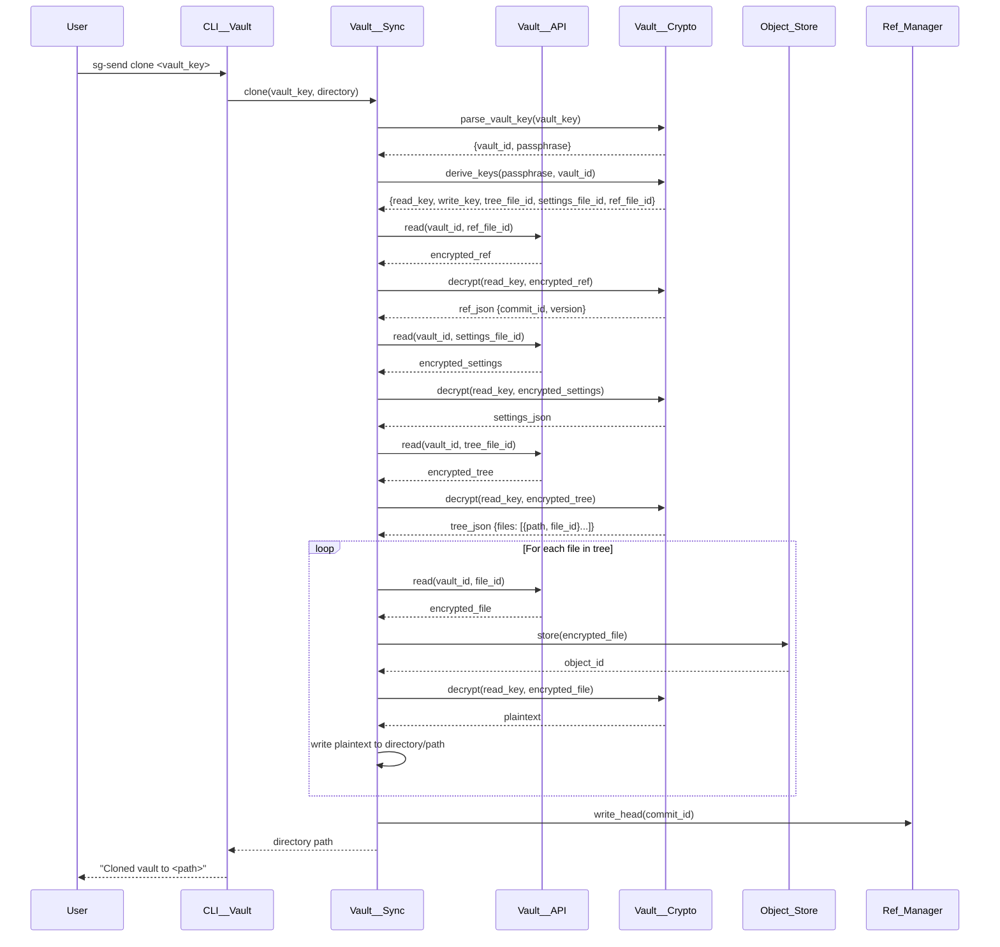
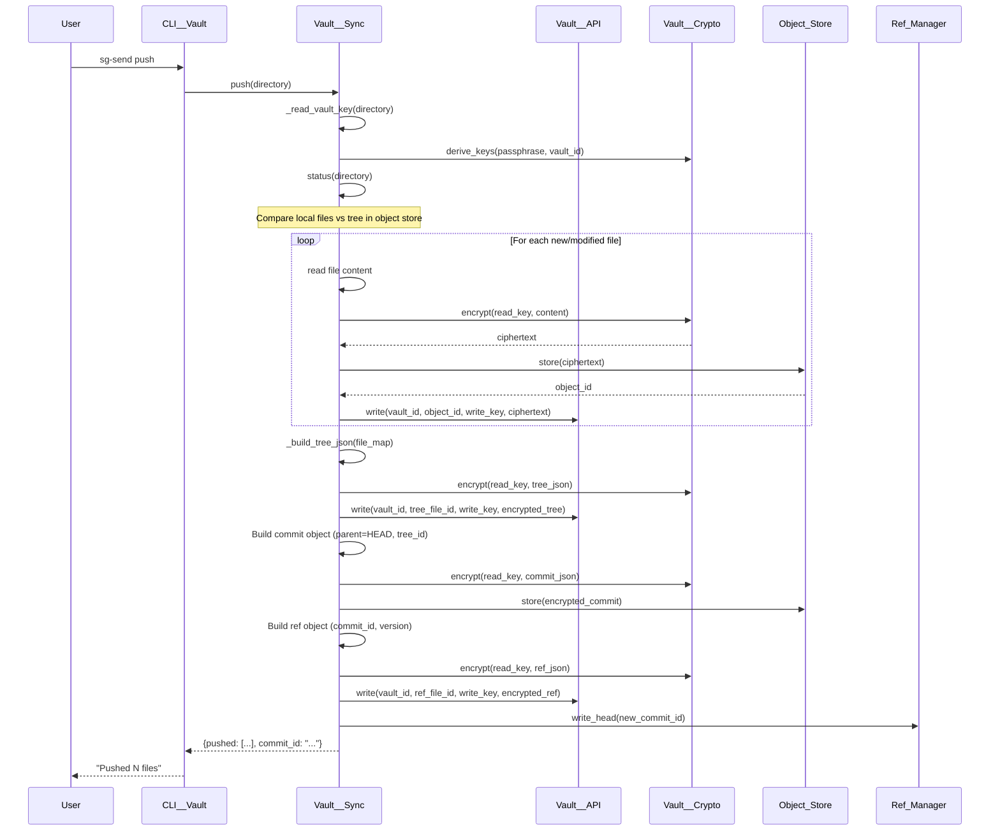

# Architect Review: Deep Code Audit — v0.5.11

## Baseline Metrics

| Metric                 | Value                        |
|------------------------|------------------------------|
| Package version        | v0.5.11                      |
| Python source files    | 51                           |
| Total source lines     | 2,381                        |
| Test files             | 48                           |
| Test methods           | 430 passing, 28 skipped      |
| Code coverage          | **83%** (400 lines uncovered)|
| Type_Safe compliance   | **94%** (48/51 files clean)  |

---

## Architecture Overview

```
                          ┌──────────────┐
                          │  CLI__Main   │
                          │  (argparse)  │
                          └──────┬───────┘
                     ┌───────────┼───────────┐
                     ▼           ▼           ▼
              ┌────────────┐ ┌─────────┐ ┌──────────────────┐
              │ CLI__Vault │ │ CLI__PKI│ │CLI__Credential   │
              │ (30 cmds)  │ │(13 cmds)│ │    _Store        │
              └─────┬──────┘ └────┬────┘ └────────┬─────────┘
                    │             │               │
         ┌──────────┼─────┐      │               │
         ▼          ▼     ▼      ▼               ▼
   ┌──────────┐ ┌──────┐ ┌──────────┐    ┌──────────────┐
   │Vault     │ │Vault │ │Vault     │    │Secrets       │
   │  __Sync  │ │__Bare│ │__Legacy  │    │  __Store     │
   │          │ │      │ │  _Guard  │    │              │
   └────┬─────┘ └──┬───┘ └──────────┘    └──────┬───────┘
        │          │                             │
   ┌────┼──────────┼────────────┐                │
   ▼    ▼          ▼            ▼                ▼
┌──────────┐ ┌──────────┐ ┌──────────┐   ┌──────────────┐
│Vault     │ │Vault     │ │Vault     │   │Vault__Crypto │
│__Object  │ │__Ref     │ │__Inspector│  │(AES,HKDF,    │
│  _Store  │ │  _Manager│ │          │   │ PBKDF2)      │
└────┬─────┘ └──────────┘ └──────────┘   └──────────────┘
     │
     ▼
┌──────────────┐     ┌──────────────┐
│ Vault__API   │     │ PKI__Crypto  │
│ (HTTP client)│     │ (RSA, ECDSA) │
└──────────────┘     └──────────────┘
     │                      │
     ▼                      ▼
┌──────────────┐     ┌──────────────┐
│API__Transfer │     │PKI__Key_Store│
│(MCP endpoint)│     │PKI__Keyring  │
└──────────────┘     └──────────────┘
```

---

## Data Flow: Clone Operation



---

## Data Flow: Push Operation



---

## Data Flow: Encryption Pipeline

```
Vault Key: "my-passphrase:a1b2c3d4"
                │
                ▼
        ┌───────────────┐
        │ parse_vault_key│
        └───────┬───────┘
                │
      ┌─────────┴─────────┐
      ▼                   ▼
  passphrase         vault_id
  "my-passphrase"    "a1b2c3d4"
      │                   │
      ▼                   │
  ┌──────────────┐        │
  │ PBKDF2       │        │
  │ 600K iters   │        │
  │ salt=prefix+ │◄───────┘
  │      vault_id│
  └──────┬───────┘
         │
    master_key (32 bytes)
         │
    ┌────┴────────────────────────────────────┐
    ▼              ▼              ▼            ▼
┌────────┐   ┌────────┐   ┌────────┐   ┌─────────┐
│HKDF    │   │HKDF    │   │HMAC    │   │HMAC     │
│info=   │   │info=   │   │domain= │   │domain=  │
│"read"  │   │"write" │   │"tree"  │   │"settings│
└───┬────┘   └───┬────┘   └───┬────┘   └───┬─────┘
    ▼            ▼            ▼             ▼
 read_key    write_key   tree_file_id  settings_file_id
 (32 bytes)  (32 bytes)  (12 hex)     (12 hex)
    │
    ▼
┌───────────────────────────────────────┐
│         AES-256-GCM Encrypt           │
│  IV (12 random bytes) + plaintext     │
│  → IV || ciphertext || GCM tag        │
└───────────────────────────────────────┘
```

---

## Object Store Layout

```
.sg_vault/
├── VAULT-KEY                    # plaintext vault key (not in bare mode)
├── refs/
│   └── head                     # current commit ID (12 hex chars)
├── objects/
│   ├── a1/
│   │   └── b2c3d4e5f6          # encrypted blob (content-addressed)
│   ├── ff/
│   │   └── 0123456789          # encrypted blob
│   └── ...
└── (no tree.json — legacy format)

File Naming: objects/{id[0:2]}/{id[2:12]}
ID Computation: SHA256(ciphertext)[0:12]
```

---

## Type_Safe Violations Found

### CRITICAL: Raw Primitives in Type_Safe Classes

| File | Field | Current Type | Required Type |
|------|-------|-------------|---------------|
| `Schema__PKI_Key_Pair.py:10` | `key_size` | `int` | `Safe_UInt__Key_Size` |
| `Schema__PKI_Key_Pair.py:12-13` | `public_key_pem`, `public_signing_key_pem` | `str` | `Safe_Str__PEM_Key` |
| `Schema__PKI_Public_Key.py:10-11` | `public_key_pem`, `signing_key_pem` | `str` | `Safe_Str__PEM_Key` |

### MAJOR: Semantic Type Mismatches

| File | Field | Current Type | Correct Type |
|------|-------|-------------|-------------|
| `Schema__Transfer_File.py:13` | `content_type` | `Safe_Str__File_Path` | `Safe_Str__Content_Type` (new) |
| `Schema__Vault_Config.py:9` | `endpoint_url` | `Safe_Str__File_Path` | `Safe_Str__Base_URL` (exists) |

### MINOR: Other Issues

| File | Issue |
|------|-------|
| `CLI__Credential_Store.py:16` | `lock_timeout : int` — raw primitive |
| `CLI__Vault.py:107` | `self._clone_start_time = time.time()` — undeclared dynamic attribute |
| `CLI__PKI.py` (6 locations) | Repeated `import os` inside methods |

---

## Test Suite Violations Found

### CRITICAL: Forbidden Mocks/Patches

| File | Patch Count | What's Patched |
|------|-------------|----------------|
| `test_CLI__PKI.py` | 11 | `os.environ`, `sys.stdin`, `builtins.open`, `sys.argv` |
| `test_CLI__Commands.py` | 7 | `create_sync`, `resolve_token`, `sys.argv`, `main()` |

**Total: 18 patch instances across 2 files**

These violate the explicit CLAUDE.md rule: "No mocks."

**Remediation approach:** Replace mocks with real objects using:
- In-memory API server (already exists in `test_Vault__Local_Server.py`)
- Real temp directories for filesystem operations
- Environment variable manipulation via `os.environ` directly (not `patch.dict`)
- CLI testing via `CLI__Main().run(argv=[...])` with captured output

---

## Coverage Gap Analysis

### Files with 0% Coverage (never tested)

| File | Lines | Reason |
|------|-------|--------|
| `Schema__PKI_Key_Pair.py` | 11 | No test file exists |
| `Schema__PKI_Public_Key.py` | 9 | No test file exists |

### Files with < 70% Coverage

| File | Coverage | Uncovered Lines | Missing Test Scenarios |
|------|----------|-----------------|----------------------|
| `Vault__API.py` | 26% (49/66) | Most methods | No HTTP integration tests |
| `API__Transfer.py` | 36% (96/150) | Most methods | No API call tests |
| `CLI__Vault.py` | 66% (92/274) | init, clone, push, pull, checkout, clean cmds | CLI cmds using mocks instead of real API |
| `Vault__Inspector.py` | 67% (68/207) | format methods, commit chain walk | Missing format output tests |

### Files with 70-95% Coverage

| File | Coverage | Key Gaps |
|------|----------|----------|
| `CLI__Credential_Store.py` | 86% | Passphrase prompt path |
| `Vault__Sync.py` | 90% | Error paths, edge cases |
| `Transfer__Envelope.py` | 92% | Corrupted envelope edge case |
| `CLI__Main.py` | 92% | Version read, error handling |
| `Vault__Bare.py` | 97% | 3 error paths |

---

## Safe_* Type Test Gaps

| Safe Type | Current Tests | Missing Scenarios |
|-----------|--------------|-------------------|
| `Safe_Str__Access_Token` | 4 | Empty string rejection, max length, special chars |
| `Safe_Str__Secret_Key` | 6 | Only positive cases, no rejection tests |
| `Safe_Str__Vault_Path` | 6 | No invalid path patterns, no traversal attempts |
| `Safe_Str__Base_URL` | 5 | No malformed URL rejection |
| `Safe_Str__File_Path` | 0 (no test file!) | Entire type untested |
| `Safe_Str__Vault_Name` | 0 (no test file!) | Entire type untested |

---

## Schema Round-Trip Test Status

| Schema | Has Round-Trip Test | Notes |
|--------|-------------------|-------|
| Schema__Vault_Meta | Yes (2 tests) | Adequate |
| Schema__Vault_Config | Yes (1 test) | Adequate |
| Schema__Vault_Index | Yes (2 tests) | Adequate |
| Schema__Vault_Index_Entry | Yes (1 test) | Adequate |
| Schema__Secret_Entry | Yes (1 test) | Adequate |
| Schema__Object_Commit | Yes (5 tests) | Excellent |
| Schema__Object_Tree | Yes (2 tests) | Adequate |
| Schema__Object_Ref | Yes (2 tests) | Adequate |
| Schema__Transfer_File | Yes (1 test) | Adequate |
| **Schema__PKI_Key_Pair** | **No test file** | **GAP** |
| **Schema__PKI_Public_Key** | **No test file** | **GAP** |
| Schema__Object_Tree_Entry | No dedicated test | Tested via Schema__Object_Tree |
